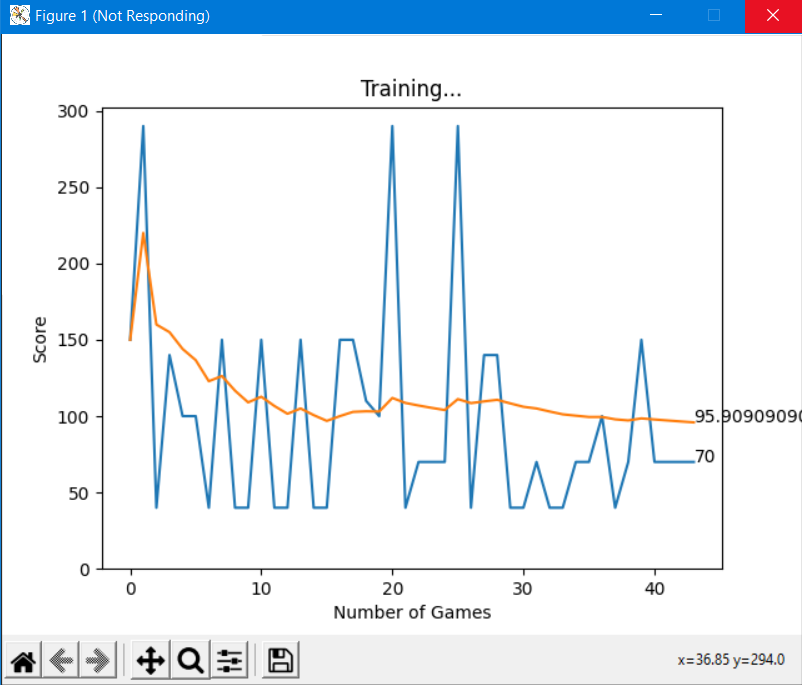

# Deep Q Learning - Global Window

## CNN_V1
LR = 0.001
Gamma = 0.2
Uses 2 CNN > ReLu > 2 Linear Layers
Interleaves Explore and Exploitation  

## Linear_V1  

LR = 0.001
Gamma = 0.8
3 Linear Layer, 7056 > 1028 > 64 > 4
Interleaves Explore and Exploitation  

## Linear_V2  

LR = 0.001  
Gamma = 0.2  
3 Linear Lyaers, 1008 > 256 > 64 > 4
Interleaves Explore and Exploitation    

