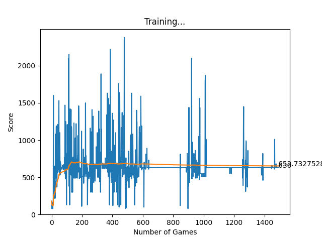
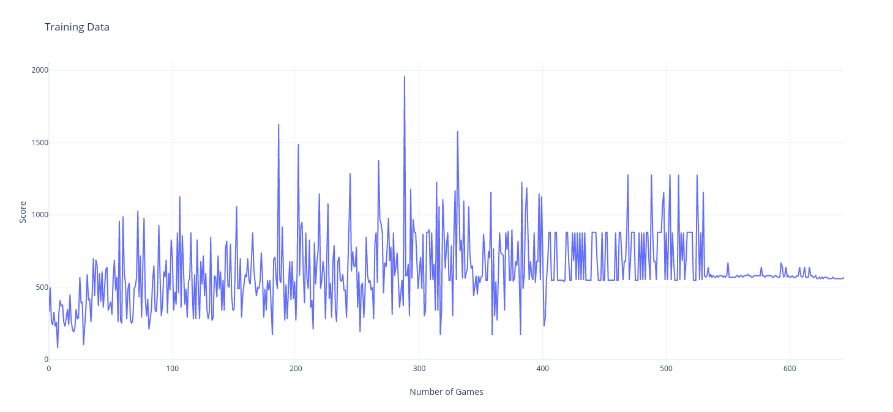
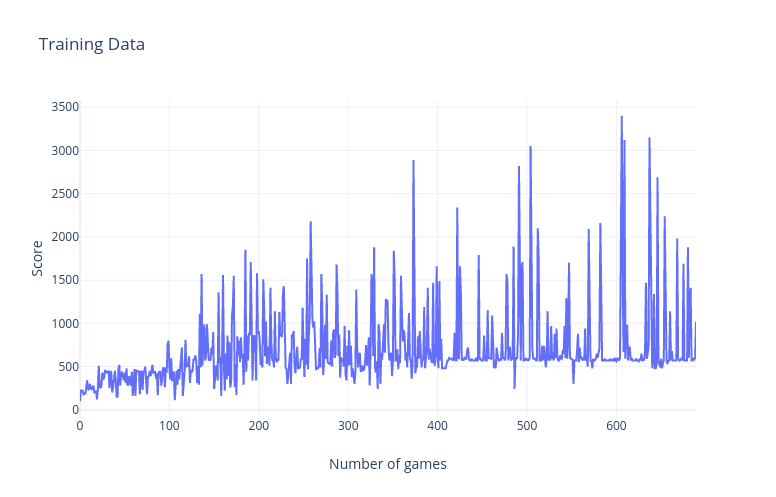

# Deep Q Learning - Small Window

## V1
LR = 0.001
Gamma = 0.8
2 Linear Layer, Size 256
First 20 moves explore, then exploit

## V2
LR = 0.0003
Gamma = 0.8
2 Linear Layer, Size 256, Input Size 56 - Look Ahead
First 400 games explore with decreasing chance, after 400 games is exploit

## V3
LR = 0.0005
Gamma = 0.2
2 Linear Layer, Size 256, Input Size 56 - Look Ahead
First 400 games explore with decreasing chance, after 400 games is exploit
